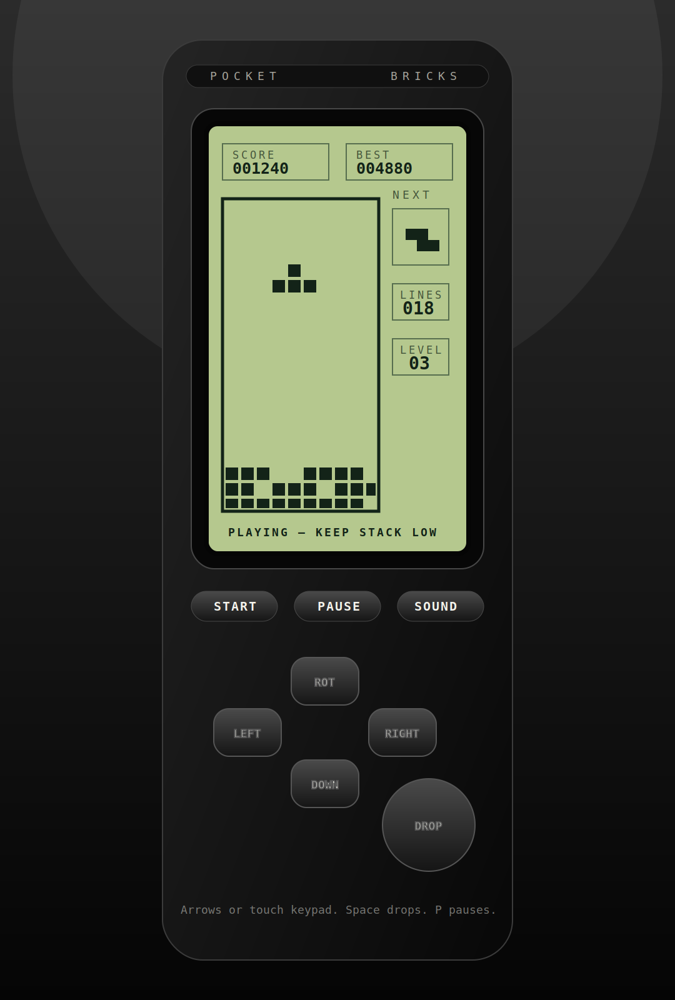

# Pocket Bricks

<p align="center">
  
</p>

Pocket Bricks is an open-source, smartphone-first falling-block puzzle game built to feel like the clean monochrome games people remember from old button phones: small LCD-style screen, simple controls, no clutter, fast restarts, and a focused score chase.

It is intentionally lightweight. No backend. No tracking. No copied assets. It runs as a real Android APK, and the same codebase can still run as a static web demo.

> Legal note: this is an original open-source implementation inspired by classic monochrome mobile puzzle games. It does not include proprietary Nokia assets, proprietary Tetris assets, ROMs, official logos, official sounds, or copied game code. The public name is **Pocket Bricks** to keep the repository safe for open-source use.

## Android APK

Pocket Bricks is now packaged as a real Android app with Capacitor.

Every push to `main` runs the **Build Android APK** workflow. When it passes, GitHub uploads an installable debug APK artifact named:

```text
pocket-bricks-debug-apk
```

### Install on Android without Play Store

1. Open the repository on your phone.
2. Go to **Actions**.
3. Open the latest successful **Build Android APK** run.
4. Download the `pocket-bricks-debug-apk` artifact.
5. Extract it if Android downloads it as a ZIP.
6. Tap `pocket-bricks-debug.apk`.
7. Allow **Install unknown apps** for the browser or file manager when Android asks.
8. Launch **Pocket Bricks** from the app drawer.

For public testers, publish a GitHub Release and attach the APK there. The app checks the latest GitHub Release and shows a small update notice when a newer APK exists.

## Updates

GitHub does not provide a public WebSocket channel that can safely push release updates directly to an APK. Pocket Bricks uses the safer open-source method:

- The installed app checks the latest GitHub Release occasionally.
- If the release tag is newer than the installed app version, it shows **GET UPDATE** inside the game.
- The button opens the GitHub Releases page.
- No tracking server, no forced updates, no Play Store dependency.

## Web demo

The web demo can still be deployed manually with the GitHub Pages workflow:

```text
https://imranshiundu.github.io/pocket-bricks/
```

The Pages workflow is manual-only to stop failed deploy emails from arriving on every normal code push.

## What it delivers

- Real Android APK build workflow.
- Classic 10 x 20 falling-block board.
- Seven familiar block shapes.
- Memoryless old-phone style piece selection instead of a modern 7-bag feel.
- Simple wall-kick rotation that feels forgiving without becoming modern/arcade-heavy.
- Classic scoring table: single, double, triple, four-line clear.
- Smartphone keypad with left, right, down, rotate, and drop.
- Keyboard support for desktop testing.
- Monochrome LCD visual direction.
- Local memory: best score, last score, games played, best level, best lines, sound preference, and update-check state.
- Optional square-wave beeps generated by Web Audio.
- Native haptic taps where supported.
- In-app GitHub release update notice.
- Core game logic separated from rendering and covered by tests.

## Interface rule

The game UI is not a fake phone. The app keeps only the useful parts: the LCD game screen and button-style controls. The phone body/mockup has been removed so it feels like a real smartphone game with old-phone taste, not a screenshot inside a phone template.

## Controls

### Smartphone

| Button | Action |
| --- | --- |
| LEFT | Move block left |
| RIGHT | Move block right |
| DOWN | Soft drop |
| ROT | Rotate clockwise |
| DROP | Hard drop |
| START | Start or restart |
| PAUSE | Pause or resume |

### Keyboard

| Key | Action |
| --- | --- |
| Arrow Left / 4 / A | Move left |
| Arrow Right / 6 / D | Move right |
| Arrow Down / 8 / S | Soft drop |
| Arrow Up / 5 / W | Rotate |
| Space / 0 | Hard drop |
| Enter | Start |
| P | Pause |

## Run locally

```bash
npm install
npm test
npm run serve
```

Then open:

```text
http://localhost:4173
```

## Build APK locally

```bash
npm install
npx cap add android
npm run sync:android
cd android
./gradlew assembleDebug
```

The APK will be created at:

```text
android/app/build/outputs/apk/debug/app-debug.apk
```

## Project structure

```text
.
├── assets/                  # Original icon and visual assets
├── docs/                    # Architecture, gameplay, and testing docs
├── native/                  # Native Android build notes
├── src/
│   ├── app.js               # Canvas, controls, local memory, sound, native hooks, update checker
│   ├── game.js              # Pure game engine: board, movement, scoring, collisions
│   └── styles.css           # Monochrome LCD screen and mobile keypad UI
├── tests/                   # Node test suite for the game engine
├── capacitor.config.json    # Native app configuration
├── index.html               # App entry
├── manifest.webmanifest     # Web demo install metadata
├── sw.js                    # Offline cache for web demo
└── package.json             # Scripts and metadata
```

## Architecture

The game has two layers:

1. **Game engine** — `src/game.js` is pure JavaScript. It knows nothing about the DOM. This makes movement, rotation, collision, line clearing, scoring, and level progression testable.
2. **App shell** — `src/app.js` handles canvas drawing, touch controls, keyboard controls, local memory, sound, native haptics, release update checks, and web install prompts.

This separation keeps the project easy for open-source contributors to understand.

## Testing

```bash
npm test
```

The current suite checks board dimensions, rotation, wall collision, line clearing, score application, hard drop, and pause behavior.

## Open-source standards

This repository includes:

- MIT license.
- Contribution guide.
- Code of conduct.
- Security policy.
- GitHub Actions CI.
- Issue templates.

## Design rule

Pocket Bricks should stay small, direct, and old-phone-like. Avoid heavy animations, accounts, payments, ads, bloated dependencies, skins, loot mechanics, or AI features. The goal is not to modernize the memory away. The goal is to preserve the feeling while making it comfortable on smartphones.
